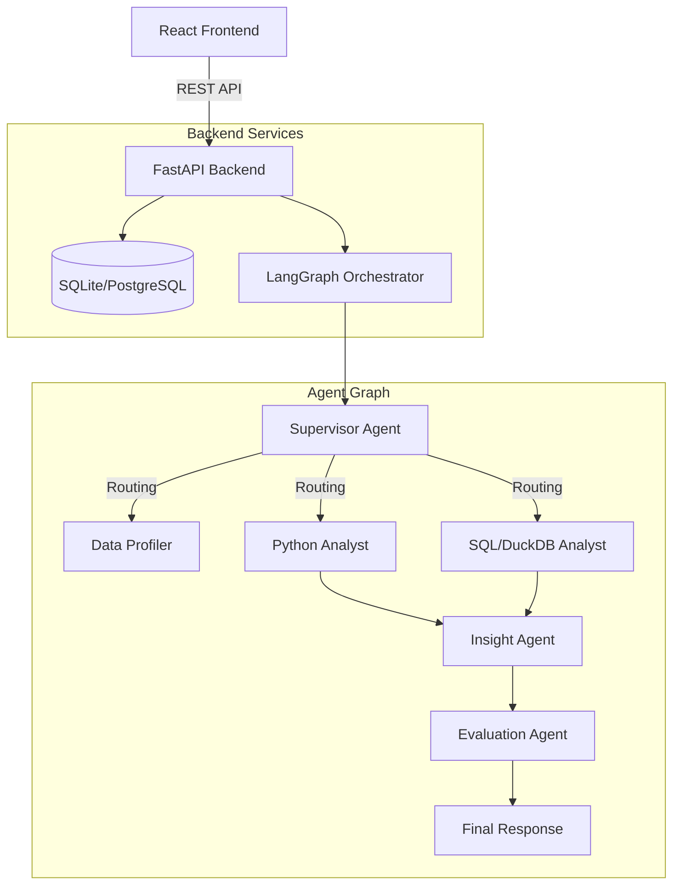

# DataPilot AI

"Talk to your data. Discover what matters."

DataPilot AI is an advanced multi-agent AI data analyst platform that allows users to upload datasets and interact with their data using natural language. It orchestrates a team of specialized AI agents to autonomously profile data, generate SQL/Python code for deterministic analysis, visualize results, and evaluate its own performance.

## Architecture

DataPilot AI separates **reasoning** from **computation**. The LLM never invents numbers; instead, it generates deterministic code (SQL via DuckDB or Python via Pandas) that executes securely against the dataset to yield accurate results.



## Features

- **Automated Dataset Profiling:** Instantly detect data types, missing values, duplicates, and column distributions.
- **Data Quality Scoring:** Get an immediate assessment of your dataset's health.
- **Multi-Agent Chat:** Ask natural language questions and let the Supervisor agent route your query to the Python or SQL Analyst.
- **Deterministic Computation:** Uses DuckDB and Pandas for 100% accurate mathematical analysis.
- **Self-Evaluating AI:** The Evaluation Agent scores every response for accuracy, groundedness, and hallucination probability.
- **Interactive Dashboards:** Automatically generated Recharts visualizations based on your dataset schema.

## Tech Stack
- **Frontend:** React, Vite, TypeScript, Tailwind CSS v4, shadcn/ui, Recharts
- **Backend:** Python, FastAPI, SQLAlchemy, LangGraph, DuckDB, Pandas
- **LLM Support:** Google Gemini, Groq (Llama 3)

## Running Locally

1. **Clone & Setup Environment:**
   Create a `.env` file in the `backend/` directory:
   ```env
   GEMINI_API_KEY=your_key_here
   ```

2. **Start Backend (FastAPI):**
   ```bash
   cd backend
   python -m venv venv
   source venv/bin/activate  # or .\venv\Scripts\activate on Windows
   pip install -r requirements.txt
   uvicorn app.main:app --host 0.0.0.0 --port 8000
   ```

3. **Start Frontend (Vite):**
   ```bash
   cd frontend
   npm install
   npm run dev
   ```

## Docker Deployment
```bash
docker-compose up --build
```
